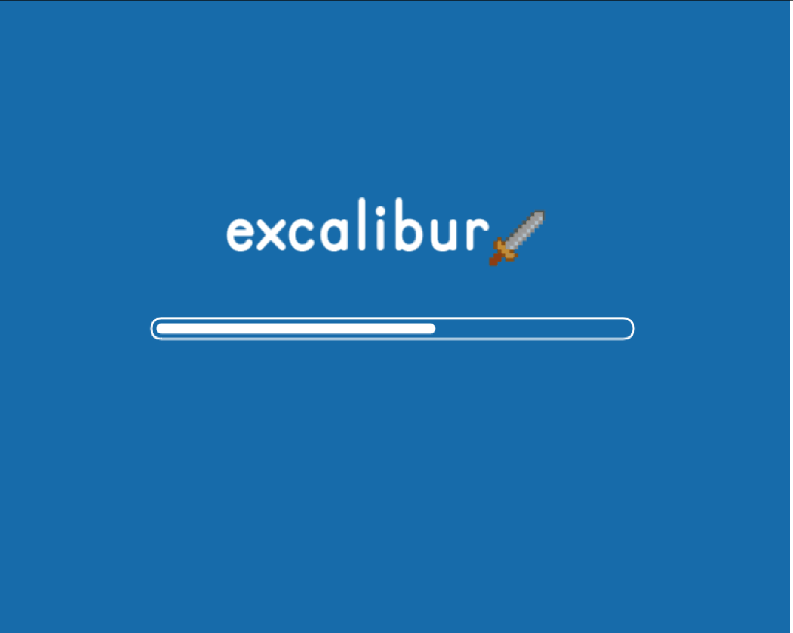

# Excalibur Shoot'em Up Sample

Play now [here](https://excaliburjs.com/sample-shootemup)

## Running locally

* Using [nodejs](https://nodejs.org/en/) and [npm](https://www.npmjs.com/)
* Run the `npm install` to install dependencies
* Run the `npm run dev` to run the development server to test out changes
   * [Webpack](https://webpack.js.org/) will build the [typescript](https://www.typescriptlang.org/) into javascript
   * [Webpack dev server](https://webpack.js.org/configuration/dev-server/) will host the script in a little server on http://localhost:8082/

## Building bundles

* Run `npm run build:dev` to produce javascript bundles for debugging in the `dist/` folder
* Run `npm run build:prod` to produce javascript bundles for production (minified) in the `dist/` folder